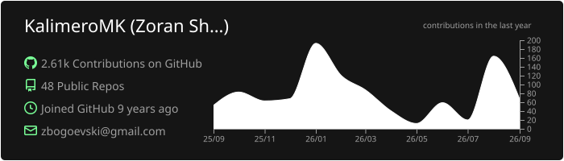
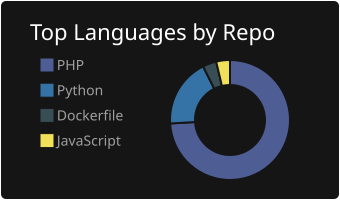
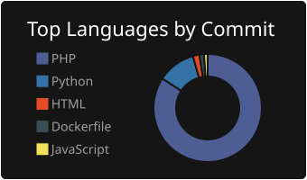
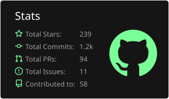
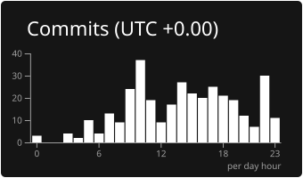

# Hi there, I'm Zoran Bogoevski! 👋

### 🚀 Senior Backend Developer | REST API Architect

I'm a seasoned backend developer based in **Skopje**, with over **15 years of experience** in creating efficient and scalable web solutions. I specialize in building robust REST APIs and high-performance backend systems.

---

### 👨‍💻 About Me

- 🎓 **Experience:** Dedicated over a decade to backend architecture and database optimization.
- 💻 **Core Focus:** Building RESTful services using modern PHP frameworks (**Laravel, Yii 2, Slim 4**).
- 🌟 **Skills:** Designing scalable APIs, server-side logic, and ensuring seamless integration across complex systems.
- 🌐 **Passion:** Committed to continuous learning, keeping up with the latest backend technologies, DevOps practices, and Microservices architecture.
- 🤝 **Collaboration:** Open to backend-focused projects, mentoring, and contributing to the tech community.

---

### 🔧 Technologies I Work With:

 

 

 

 

---

### 🏆 Top Contributions

---

### 📫 Get in Touch:

Feel free to connect with me and explore my projects. Let's code something awesome together! 🚀

